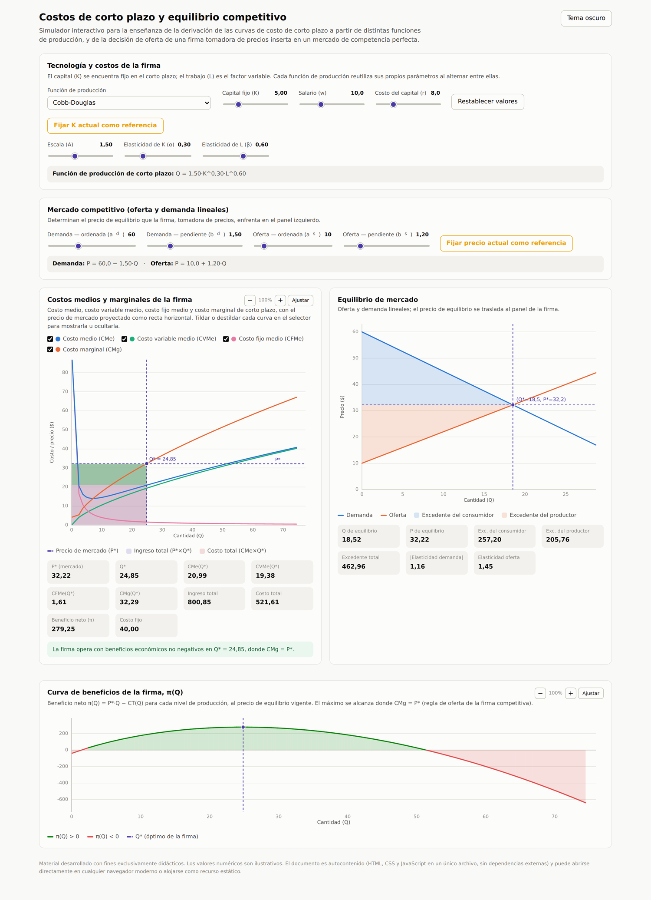

# Simulador de costos de corto plazo y equilibrio competitivo



Simulador interactivo, en HTML/JavaScript autocontenido, para la derivación gráfica y numérica de las curvas de costo de corto plazo de una firma a partir de distintas funciones de producción, y para el análisis de su decisión de oferta como tomadora de precios dentro de un mercado de competencia perfecta. Desarrollado como material didáctico para un curso de Microeconomía Intermedia de nivel universitario (Bloque 2 — Teoría de la producción y costos).

**Acceso directo (una vez publicado, ver más abajo):**

```
https://fcontiggiani.github.io/equilibrio-firmacp-cp/costos_cortoplazo_standalone.html
```

## Contenido del repositorio

| Archivo | Descripción |
|---|---|
| `costos_cortoplazo_standalone.html` | El simulador completo: marcado, estilos y lógica en un único documento, sin dependencias externas más allá de la tipografía del sistema. No requiere proceso de compilación ni instalación de paquetes: basta con abrirlo en cualquier navegador moderno con JavaScript habilitado. |
| `screenshot.png` | Captura de pantalla del simulador, utilizada como vista previa en este documento. |
| `README.md` | Este documento. |

## Modelo económico

**Tecnología de la firma.** El capital (K) es fijo en el corto plazo; el trabajo (L) es el único factor variable. El usuario elige entre cinco funciones de producción de corto plazo —Cobb-Douglas, Leontief (proporciones fijas), sustitutos perfectos, CES y una forma cúbica con rendimientos marginales primero crecientes y luego decrecientes—, cada una con sus propios parámetros y valores por defecto, que se conservan al alternar entre tecnologías.

A partir de la función de producción vigente, el simulador deriva numéricamente el costo variable, el costo total, el costo medio, el costo variable medio y el costo marginal, mediante una grilla uniforme en el factor trabajo (no en la cantidad producida). Esta elección de diseño es deliberada: para las tecnologías con una capacidad máxima genuina de corto plazo (Leontief y la cúbica), el producto marginal del trabajo tiende a cero cerca de esa cota, de modo que una grilla uniforme en Q subestimaría el costo marginal justo donde debería dispararse; recorrer el trabajo de manera uniforme evita esa distorsión.

**Decisión de oferta de la firma.** Dado el precio de equilibrio del mercado, la firma maximiza π(Q) = P·Q − CT(Q), comparando el óptimo hallado contra la alternativa de cierre en el corto plazo (Q = 0, con pérdida igual al costo fijo). El simulador distingue explícitamente tres situaciones y las señala en el panel de resultados: (i) cierre en el corto plazo, cuando ningún nivel de producción cubre el costo variable medio; (ii) solución de esquina por restricción de capacidad, cuando la tecnología (Leontief o cúbica) impide producir más allá de un límite físico dado K, aun cuando el costo marginal en ese punto sea menor al precio; y (iii) ausencia de óptimo interior, un caso propio de tecnologías con costo marginal constante o asintóticamente constante (sustitutos perfectos, o CES con alta elasticidad de sustitución), en el que la oferta de la firma no está acotada por el lado de la tecnología dentro del rango numérico explorado.

**Mercado.** La oferta y la demanda se modelan como funciones lineales inversas, con ordenada y pendiente ajustables de forma independiente para cada curva. El precio de equilibrio resultante se proyecta como referencia en el panel de costos de la firma, junto con el excedente del consumidor, el excedente del productor y las elasticidades precio de ambas curvas evaluadas en el equilibrio.

**Curva de beneficios.** Un panel inferior traza π(Q) para todo el rango de producción explorado, al precio de equilibrio vigente, coloreando en verde los tramos de beneficio positivo y en rojo los de pérdida, y marcando el punto óptimo de la firma.

**Escenarios de referencia para análisis comparativo.** El simulador permite fijar un punto de comparación antes de introducir un cambio de parámetros, mediante dos mecanismos independientes y simultáneamente activables:

- *Fijar K actual como referencia*: congela una fotografía de la tecnología, el capital y los precios de los factores vigentes (K₀, w₀, r₀), y superpone sus curvas de costo medio y marginal —en trazo punteado— sobre el panel de costos, evaluadas siempre al precio de mercado *actual*.
- *Fijar precio actual como referencia*: congela el equilibrio de mercado vigente en su totalidad —las curvas de oferta y demanda que lo generaron y las coordenadas del punto (Q₀, P₀)—, y lo superpone en tres lugares: como recta horizontal adicional en el panel de costos (con la elección óptima de la firma a ese precio), como curvas y punto punteados en el propio panel de equilibrio de mercado, y en la curva de beneficios.

Ambos mecanismos incluyen paneles de notas que cuantifican las diferencias (ΔQ*, Δπ, ΔP, Δexcedentes) entre cada escenario de referencia y la situación vigente.

## Características de la interfaz

- Controles deslizantes para la tecnología de la firma (función de producción y sus parámetros propios, capital fijo, salario y costo del capital) y para el mercado (ordenada y pendiente de oferta y demanda).
- Tres paneles gráficos en canvas: costos medios y marginales de la firma (con las áreas de costo total, ingreso total y beneficio neto proyectadas al precio de mercado), equilibrio de mercado (con los excedentes sombreados) y la curva de beneficios.
- Zoom independiente en el panel de costos y en el de beneficios (acercar, alejar y ajuste automático), cada uno con su propio nivel de acercamiento; el contenido se recorta al área de trazado para que las curvas no se desborden sobre los ejes.
- Alternancia entre tema claro y tema oscuro (por defecto sigue la preferencia del sistema operativo; el botón fija una preferencia explícita para el resto de la sesión), con una paleta de colores validada para su distinción en daltonismo y contraste sobre ambas superficies.
- Fijación de escenarios de referencia (K₀ y/o P₀) para comparación "antes y después", según se describe en la sección anterior.
- Paneles de lectura numérica con los valores calculados (Q*, precio, costos, ingreso, beneficio, excedentes, elasticidades) y notas explicativas que se adaptan al caso vigente (operación normal, pérdida con continuidad, cierre, o solución de esquina).
- Botón para restablecer todos los parámetros y referencias a sus valores por defecto.
- Diseño responsive: los paneles se apilan verticalmente en pantallas angostas.

## Uso local

Clonar o descargar este repositorio y abrir `costos_cortoplazo_standalone.html` directamente en el navegador. No se requiere servidor ni conexión a internet una vez descargado el archivo.

## Publicación en GitHub Pages

Este repositorio ya está preparado para publicarse mediante GitHub Pages:

1. En este repositorio, ir a **Settings → Pages**.
2. En **Build and deployment → Source**, seleccionar **Deploy from a branch**.
3. Elegir la rama `main` y la carpeta `/ (root)`, y hacer clic en **Save**.
4. Aguardar entre uno y diez minutos. El simulador quedará disponible en:

   ```
   https://fcontiggiani.github.io/equilibrio-firmacp-cp/costos_cortoplazo_standalone.html
   ```

Toda actualización posterior del archivo (nueva versión subida al repositorio) se refleja automáticamente en esa misma dirección, sin necesidad de modificar los enlaces ya distribuidos (por ejemplo, en Moodle).

### Integración en Moodle

El enlace anterior puede incorporarse a un curso de Moodle como recurso de tipo **URL** (opción recomendada por su fiabilidad, independiente de la configuración de seguridad del entorno) o incrustarse mediante un `<iframe>` dentro de una Etiqueta o Página del curso:

```html
<iframe src="https://fcontiggiani.github.io/equilibrio-firmacp-cp/costos_cortoplazo_standalone.html"
        width="100%" height="900" style="border:none;">
</iframe>
```

Si la instalación institucional de Moodle elimina el `<iframe>` al guardar (por no tener habilitada la confianza en contenido enriquecido), se recomienda utilizar directamente el recurso de tipo URL.

## Licencia y uso

Material desarrollado con fines exclusivamente didácticos. Los valores numéricos de ejemplo son ilustrativos salvo que se indique explícitamente lo contrario. Se autoriza su uso, adaptación y redistribución con fines educativos, citando la fuente.
